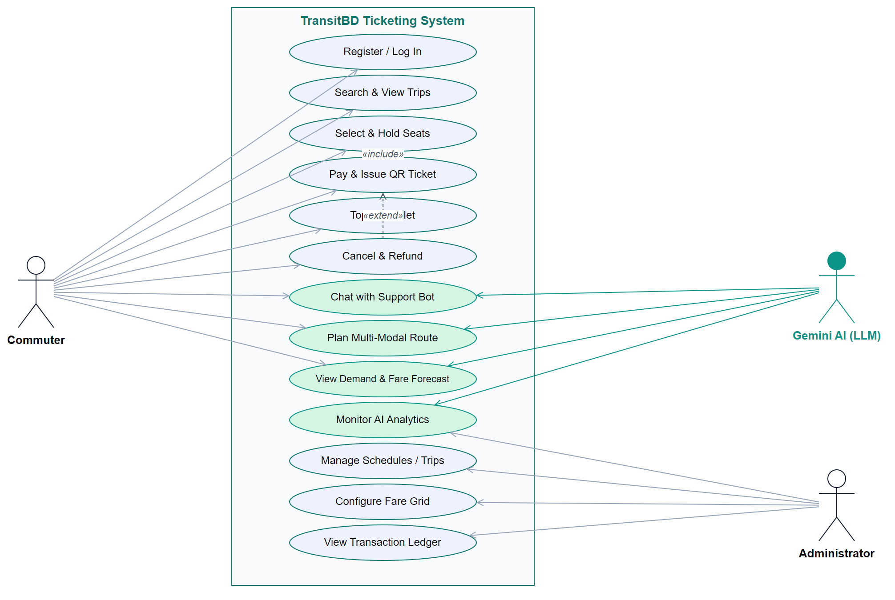
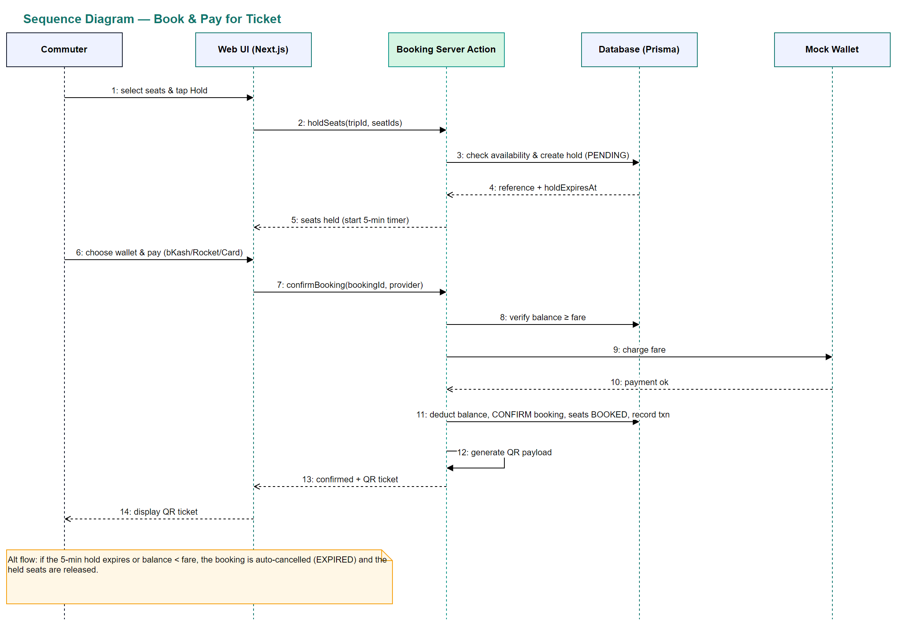
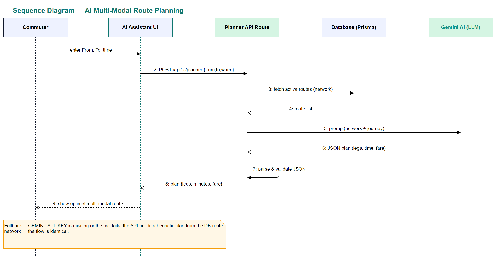
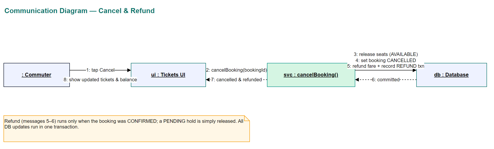
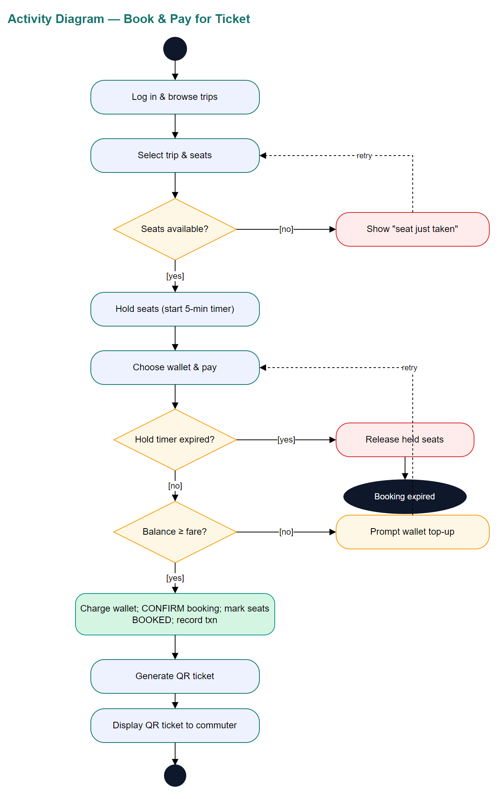
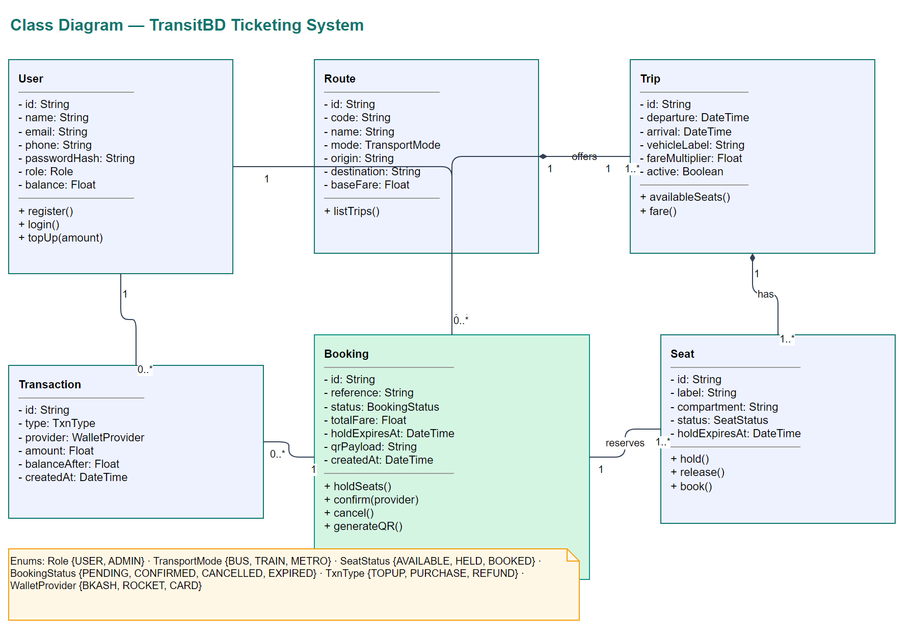

# TransitBD — UML Diagrams

All diagrams were modelled in **draw.io (diagrams.net)**. Each `.drawio` file is
editable; click the **Open in draw.io** links to view/edit live.

| # | Diagram | Use case | Files |
|---|---------|----------|-------|
| 1 | Use Case Diagram | Whole system | `use-case.drawio` |
| 2 | Detailed Use Case Description | Book & Pay for Ticket | `use-case-description.md` |
| 3 | Sequence Diagram | Book & Pay for Ticket | `sequence-booking.drawio` |
| 4 | Sequence Diagram | AI Multi-Modal Route Planning | `sequence-routeplanner.drawio` |
| 5 | Communication Diagram | Cancel & Refund | `communication-cancel.drawio` |
| 6 | Activity Diagram | Book & Pay for Ticket | `activity-booking.drawio` |
| 7 | Class Diagram | Whole system | `class-diagram.drawio` |

## 1 · Use Case Diagram

[Open in draw.io](https://app.diagrams.net/?url=https%3A%2F%2Fraw.githubusercontent.com%2FMunem3%2Ftransit-ticketing-system%2Fmain%2Fdocs%2Fuse-case.drawio)

## 3 · Sequence Diagram — Book & Pay for Ticket

[Open in draw.io](https://app.diagrams.net/?url=https%3A%2F%2Fraw.githubusercontent.com%2FMunem3%2Ftransit-ticketing-system%2Fmain%2Fdocs%2Fsequence-booking.drawio)

## 4 · Sequence Diagram — AI Multi-Modal Route Planning

[Open in draw.io](https://app.diagrams.net/?url=https%3A%2F%2Fraw.githubusercontent.com%2FMunem3%2Ftransit-ticketing-system%2Fmain%2Fdocs%2Fsequence-routeplanner.drawio)

## 5 · Communication Diagram — Cancel & Refund

[Open in draw.io](https://app.diagrams.net/?url=https%3A%2F%2Fraw.githubusercontent.com%2FMunem3%2Ftransit-ticketing-system%2Fmain%2Fdocs%2Fcommunication-cancel.drawio)

## 6 · Activity Diagram — Book & Pay for Ticket

[Open in draw.io](https://app.diagrams.net/?url=https%3A%2F%2Fraw.githubusercontent.com%2FMunem3%2Ftransit-ticketing-system%2Fmain%2Fdocs%2Factivity-booking.drawio)

## 7 · Class Diagram

[Open in draw.io](https://app.diagrams.net/?url=https%3A%2F%2Fraw.githubusercontent.com%2FMunem3%2Ftransit-ticketing-system%2Fmain%2Fdocs%2Fclass-diagram.drawio)
